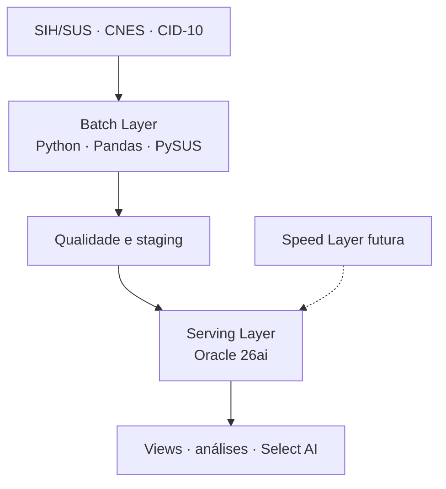

# MindLink

## Dados públicos para enxergar pressão hospitalar antes que ela vire crise

**Challenge Oracle + FIAP 2026 · Equipe She Leads**

Imagine que cada hospital seja uma caixa-d'água. As internações entram, os leitos representam a capacidade e os dias de permanência mostram por quanto tempo essa capacidade fica ocupada.

O problema é que os dados existem em lugares diferentes e chegam com atraso. A MindLink organiza essas informações para ajudar o gestor a perceber onde a pressão associada à demência está crescendo — antes de tratar uma estimativa como se fosse disponibilidade de leito em tempo real.

> A MindLink não decide para onde um paciente deve ir. Ela transforma dados públicos em uma sinalização auditável para apoiar planejamento.

## O que o projeto faz

1. Lê internações do SIH/SUS e identifica os CIDs `F00`, `F01`, `F02`, `F03` e `G30`.
2. Considera demência tanto no diagnóstico principal quanto nos diagnósticos secundários.
3. Padroniza município, hospital, competência, faixa etária, permanência, valor e óbito.
4. Agrega os dados no mesmo grão do modelo Oracle e produz arquivos de staging, validações e evidências.

## O que está comprovado hoje

| Componente | Situação | O que podemos afirmar |
|---|---|---|
| ETL Python em modo demonstrativo | Executado e testado | O fluxo completo gera dados sintéticos determinísticos, valida qualidade e produz as stagings esperadas. |
| ETL com PySUS | Implementado, dependente da fonte | O código aceita coleta por UF, ano e mês. A execução depende da disponibilidade do PySUS/DATASUS e dos arquivos auxiliares de CNES e CID. |
| Apache Airflow | Executado | A DAG executou o ETL demonstrativo e validou a conexão com o Oracle. |
| Oracle Autonomous Database | Evidenciado na Sprint 3 | Staging, dimensões, fatos e views foram apresentados no ambiente da equipe. Nesta revisão, o acesso Oracle está indisponível e não foi reexecutado. |
| Contagem de 3.305 registros | Validada pela DAG | A DAG consultou a staging Oracle já existente e confirmou `3.305` registros. Ela não carregou esses registros nessa mesma execução. |
| Select AI | Dependente do ambiente Oracle | As perguntas e consultas de referência existem, mas a execução ao vivo exige perfil, credencial e acesso ao banco. |
| Previsão de 1 a 3 meses | Pesquisa/protótipo | Há estrutura de dados e notebook analítico; não existe, neste repositório, um modelo preditivo de produção validado. |
| Dashboard | Protótipo separado | A interface da fase anterior é demonstrativa e não é apresentada aqui como painel Oracle ao vivo. |

Essa distinção é intencional: **implementado**, **executado**, **evidenciado** e **planejado** não significam a mesma coisa.

## Arquitetura escolhida: Lambda

A MindLink adotou a arquitetura Lambda porque trabalha principalmente com bases públicas mensais, que precisam de histórico, reprocessamento e rastreabilidade. A camada batch está implementada. A camada de velocidade permanece prevista para fontes futuras mais frequentes; não há alegação de streaming em tempo real.



Em linguagem simples:

- **Batch Layer:** organiza o histórico completo, como quem fecha e confere o estoque do mês.
- **Serving Layer:** deixa os dados prontos para consulta, como uma prateleira organizada.
- **Speed Layer futura:** serviria para atualizações mais rápidas, caso surjam fontes adequadas. Ela ainda não foi implementada.

Mais detalhes: [arquitetura técnica](docs/ARCHITECTURE.md).

## Recorte da prova de conceito

| Item | Definição |
|---|---|
| Território | Estado de São Paulo |
| Período documentado | Competências `202401` a `202512` |
| Unidade analítica | Competência × município × CNES |
| Fonte de internações | SIH/SUS, acessado programaticamente por PySUS quando disponível |
| Capacidade hospitalar | CNES |
| Critério clínico | CID-10 `F00`, `F01`, `F02`, `F03` e `G30` |
| Diagnósticos | Principal e secundários |
| IBGE | Referência metodológica; ainda não persiste como dimensão própria no modelo atual |

## Teste local sem Oracle

O modo demonstrativo existe para provar o funcionamento do software sem internet, PySUS ou credenciais. Os valores gerados são sintéticos e não devem ser apresentados como resultado do SUS.

```bash
python -m venv .venv
source .venv/bin/activate      # Linux/macOS
# .venv\Scripts\activate       # Windows

pip install -r requirements.txt
python src/mindlink_etl_sprint3_oracle.py --demo
```

Arquivos gerados:

```text
data/raw/mindlink_sih_raw_amostra.csv
data/processed/mindlink_internacoes_demencia_tratado.csv
data/processed/stg_mindlink_internacoes_python.csv
data/processed/stg_mindlink_comorbidades_python.csv
data/evidence/mindlink_resumo_etl.csv
```

Para executar os testes automatizados:

```bash
pip install -r requirements-dev.txt
pytest
```

## Coleta real

O comando abaixo representa o caminho implementado para coleta real. Ele não faz parte do teste automatizado porque depende de disponibilidade externa e de arquivos oficiais auxiliares.

```bash
python src/mindlink_etl_sprint3_oracle.py \
  --uf SP \
  --anos 2024,2025 \
  --meses 1,2,3,4,5,6,7,8,9,10,11,12 \
  --cadastro-cnes-csv data/reference/cnes_lookup.csv \
  --cid-csv data/reference/cid10.csv
```

## Oracle

Os scripts oficiais estão separados por responsabilidade:

1. [`sql/01_ddl_mindlink_sprint3.sql`](sql/01_ddl_mindlink_sprint3.sql) cria staging, dimensões, fatos, índices e views.
2. [`sql/02_dml_mindlink_sprint3.sql`](sql/02_dml_mindlink_sprint3.sql) registra a carga utilizada na entrega e promove os dados para o modelo analítico.
3. O ETL Python pode carregar as stagings com `--oracle-load` quando o ambiente e as credenciais estiverem disponíveis.

Credenciais, Wallet e arquivos brutos nunca devem ser versionados. Use [`.env.example`](.env.example) somente como referência de nomes das variáveis.

## Estrutura do repositório

```text
mindlink/
├── src/                 ETL oficial da Sprint 3
├── dags/                DAG executada no Apache Airflow
├── sql/                 DDL e DML do modelo Oracle
├── notebooks/           análise estatística e experimentos
├── tests/               testes locais sem dependência do Oracle
├── docs/                arquitetura, status e matriz de evidências
├── data/                instruções; dados gerados não são versionados
└── docs/history/        entrega anterior preservada como contexto
```

Consulte também:

- [Status técnico e limitações](docs/STATUS.md)
- [Matriz de evidências](docs/EVIDENCE.md)
- [Jornada da arquitetura Lambda](docs/ARCHITECTURE.md)
- [Evolução do repositório](docs/HISTORY.md)

## Limites de interpretação

- Cadastro de leitos não significa leito livre.
- A proxy de pressão não substitui regulação médica ou hospitalar.
- SIH/SUS e CNES não são fontes em tempo real.
- Diagnóstico secundário depende da qualidade de preenchimento da AIH.
- O recorte de CIDs é conservador e não cobre todas as etiologias de demência.
- Resultados de São Paulo não devem ser extrapolados automaticamente para todo o Brasil.
- Dados sintéticos do modo `--demo` servem somente para teste do código.

## Equipe She Leads

- Ana Júlia Amorim — RM 572387
- Beatriz Dias da Silva — RM 569873
- Luana Ramos Rabelo — RM 570351
- Mariana Ishikawa — RM 572886
- Sthefany Feitosa da Silva — RM 568651

Projeto acadêmico desenvolvido no Challenge Oracle + FIAP 2026.
