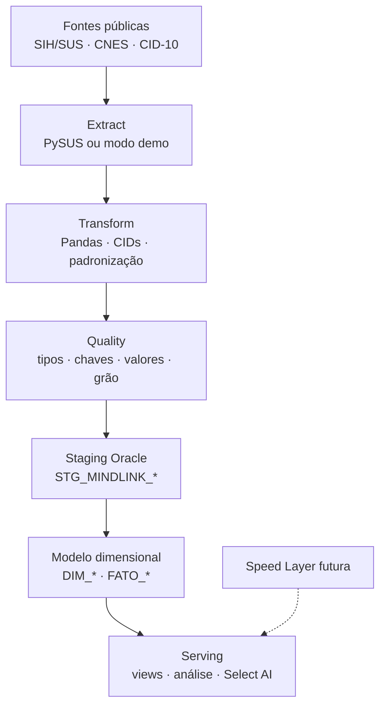

# Arquitetura Lambda da MindLink

## Por que Lambda

As bases do SIH/SUS e do CNES são históricas e publicadas por competência. Isso favorece processamento em lote, reexecução controlada e auditoria. A arquitetura Lambda foi escolhida para preservar esse núcleo batch e, ao mesmo tempo, deixar uma extensão futura para dados de menor latência.

Não existe streaming implementado nesta versão. A Speed Layer é uma possibilidade de evolução, não uma entrega concluída.

## Camadas

## Grão analítico

O núcleo observado é agregado por competência, município de atendimento, estabelecimento CNES, diagnóstico, faixa etária e sexo. As capacidades são organizadas por competência e estabelecimento.

## Papel de cada tecnologia

| Tecnologia | Papel real |
|---|---|
| Python/Pandas | Extração, transformação, qualidade e preparação das stagings |
| PySUS | Cliente opcional para acessar SIH/SUS; não é a fonte original |
| Apache Airflow | Orquestra, agenda, registra logs e controla dependências |
| Oracle Autonomous Database / 26ai | Armazena staging, dimensões, fatos e views analíticas |
| Select AI | Camada de consulta em linguagem natural dependente de perfil e credenciais |

## Proxy de pressão

A view `VW_PRESSAO_HOSPITALAR` calcula:

\[
\text{Pressão de demência (\%)} =
100 \times \frac{\text{dias de permanência associados à demência}}
{\text{leitos SUS cadastrados} \times \text{dias do mês}}
\]

O indicador representa utilização relativa de leitos-dia pela população observada no recorte. Ele não mede ocupação hospitalar total, leito livre ou possibilidade clínica de transferência.
